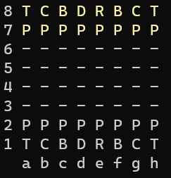

# GameChess
Jogo de xadrez aprendido no curso da Udemy é um programa em C# que permite jogar xadrez em modo console. Ele possui regras e movimentos válidos do jogo de xadrez, além de jogadas especiais, como Roque, En Passant e a promoção do Peão em uma Dama.

O código foi desenvolvido utilizando princípios de orientação a objetos e separação de responsabilidades em diferentes classes, como Tabuleiro, Peça, Jogador, Movimento, entre outras. Além disso, o código também utiliza conceitos avançados de programação, como polimorfismo, herança e sobercada de operadores.

O jogo é apresentado em modo console, com representações gráficas do tabuleiro e das peças em caracteres ASCII.

OBS: O código está com algumas coisas a melhorar, porém, ainda irei corrigir, como nomes de variáveis em português e variáveis com nomes não tão claros, assim como o Clean Code recomenda.

## Uso

## Instalação

Instruções de como instalar e configurar o projeto.

## Uso

- O projeto tem como regras o próprio jogo de xadrez, logo, todas as peças tem suas funções e movimentos de acordo com sua característia, como Peão, Cavalo, Torre, Dama, Rei e Bispo.
- Cada letra representa uma peça:
    - Peão = "P"
    - Torre = "T"
    - Cavalo = "C"
    - Bispo = "B"
    - Rei = "R"
    - Dama = "D"
- Para jogar o jogo de xadrez, precisa saber qual é a linha e a coluna que deseja mover a peça, pois o jogo é baseado em matriz:

    

    1. O qual teremos que escolher uma coluna(a, b, c, d, e, f, g, h) e uma linha(1, 2, 3, 4, 5, 6, ,7, 8) para mover a peça, por exemplo, para mover o primeiro Peão da cor branca da esquerda para direita, teremos que escolher a2(linha + coluna).
    2. Depois escolher para onde ele irá, porém foi implementado um método o qual ele diz quais os movimentos possíveis, então basta escolher, como: a2 para a4.
    3. logo, ficará, "Origem: a2", "Destino: a4", então o peão da casa **a2** se moverá para casa **a4**
- Foi implementando também algumas jogadas especiais, como:
    - 

## Contribuição

Instruções de como contribuir com o projeto.

## Licença

Breve descrição da licença utilizada pelo projeto.

